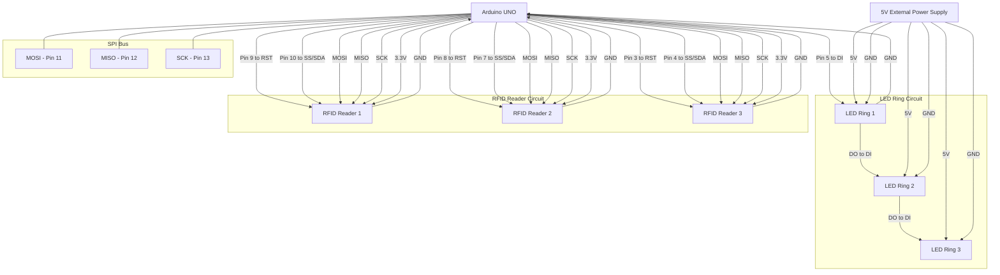

# Wiring diagram

```mermaid
graph TD
    %% Arduino and main components
    ARDUINO[Arduino UNO]
    
    %% LED Rings
    RING1[LED Ring 1]
    RING2[LED Ring 2]
    RING3[LED Ring 3]
    
    %% RFID Readers
    RFID1[RFID Reader 1]
    RFID2[RFID Reader 2]
    RFID3[RFID Reader 3]
    
    %% Power Supply
    PWR[5V External Power Supply]
    
    %% Arduino connections to RFID readers
    ARDUINO ---> |Pin 9 to RST| RFID1
    ARDUINO ---> |Pin 10 to SS/SDA| RFID1
    ARDUINO ---> |MOSI| RFID1
    ARDUINO ---> |MISO| RFID1
    ARDUINO ---> |SCK| RFID1
    
    ARDUINO ---> |Pin 8 to RST| RFID2
    ARDUINO ---> |Pin 7 to SS/SDA| RFID2
    ARDUINO ---> |MOSI| RFID2
    ARDUINO ---> |MISO| RFID2
    ARDUINO ---> |SCK| RFID2
    
    ARDUINO ---> |Pin 3 to RST| RFID3
    ARDUINO ---> |Pin 4 to SS/SDA| RFID3
    ARDUINO ---> |MOSI| RFID3
    ARDUINO ---> |MISO| RFID3
    ARDUINO ---> |SCK| RFID3
    
    %% Arduino connection to first LED Ring
    ARDUINO ---> |Pin 5 to DI| RING1
    
    %% LED Ring chain (daisy chaining)
    RING1 ---> |DO to DI| RING2
    RING2 ---> |DO to DI| RING3
    
    %% Power connections
    PWR ---> |5V| RING1
    PWR ---> |5V| RING2
    PWR ---> |5V| RING3
    PWR ---> |GND| RING1
    PWR ---> |GND| RING2
    PWR ---> |GND| RING3
    
    %% Shared ground
    RING1 ---> |GND| ARDUINO
    RFID1 ---> |GND| ARDUINO
    RFID2 ---> |GND| ARDUINO
    RFID3 ---> |GND| ARDUINO
    
    %% Power for RFID readers
    ARDUINO ---> |3.3V| RFID1
    ARDUINO ---> |3.3V| RFID2
    ARDUINO ---> |3.3V| RFID3
    
    %% Component descriptions
    subgraph "LED Ring Circuit"
        RING1
        RING2
        RING3
    end
    
    subgraph "RFID Reader Circuit"
        RFID1
        RFID2
        RFID3
    end
    
    %% SPI shared bus notation
    subgraph "SPI Bus"
        MOSI[MOSI - Pin 11]
        MISO[MISO - Pin 12]
        SCK[SCK - Pin 13]
    end
    
    ARDUINO --- MOSI
    ARDUINO --- MISO
    ARDUINO --- SCK
```
