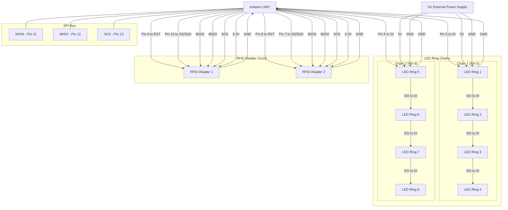

# Wiring diagram

```mermaid
graph TD
    %% Arduino and main components
    ARDUINO[Arduino UNO]
    
    %% LED Rings
    RING1[LED Ring 1]
    RING2[LED Ring 2]
    RING3[LED Ring 3]
    RING4[LED Ring 4]
    RING5[LED Ring 5]
    RING6[LED Ring 6]
    RING7[LED Ring 7]
    RING8[LED Ring 8]
    
    %% RFID Readers - Only keeping 1 and 2
    RFID1[RFID Reader 1]
    RFID2[RFID Reader 2]
    
    %% Power Supply
    PWR[5V External Power Supply]
    
    %% Arduino connections to RFID readers - Digital pins
    ARDUINO ---> |Pin 9 to RST| RFID1
    ARDUINO ---> |Pin 10 to SS/SDA| RFID1
    ARDUINO ---> |MOSI| RFID1
    ARDUINO ---> |MISO| RFID1
    ARDUINO ---> |SCK| RFID1
    
    ARDUINO ---> |Pin 8 to RST| RFID2
    ARDUINO ---> |Pin 7 to SS/SDA| RFID2
    ARDUINO ---> |MOSI| RFID2
    ARDUINO ---> |MISO| RFID2
    ARDUINO ---> |SCK| RFID2
    
    %% Arduino connection to LED Ring chains
    ARDUINO ---> |Pin 5 to DI| RING1
    ARDUINO ---> |Pin 6 to DI| RING5
    
    %% LED Ring chain 1 (daisy chaining)
    RING1 ---> |DO to DI| RING2
    RING2 ---> |DO to DI| RING3
    RING3 ---> |DO to DI| RING4
    
    %% LED Ring chain 2 (daisy chaining)
    RING5 ---> |DO to DI| RING6
    RING6 ---> |DO to DI| RING7
    RING7 ---> |DO to DI| RING8
    
    %% Power connections
    PWR ---> |5V| RING1
    PWR ---> |5V| RING5
    PWR ---> |GND| RING1
    PWR ---> |GND| RING5
    
    %% Shared ground
    RING1 ---> |GND| ARDUINO
    RING5 ---> |GND| ARDUINO
    RFID1 ---> |GND| ARDUINO
    RFID2 ---> |GND| ARDUINO
    
    %% Power for RFID readers
    ARDUINO ---> |3.3V| RFID1
    ARDUINO ---> |3.3V| RFID2
    
    %% Component descriptions
    subgraph "LED Ring Chains"
        subgraph "Chain 1 (Pin 5)"
            RING1
            RING2
            RING3
            RING4
        end
        subgraph "Chain 2 (Pin 6)"
            RING5
            RING6
            RING7
            RING8
        end
    end
    
    subgraph "RFID Reader Circuit"
        RFID1
        RFID2
    end
    
    %% SPI shared bus notation
    subgraph "SPI Bus"
        MOSI[MOSI - Pin 11]
        MISO[MISO - Pin 12]
        SCK[SCK - Pin 13]
    end
    
    ARDUINO --- MOSI
    ARDUINO --- MISO
    ARDUINO --- SCK
```
