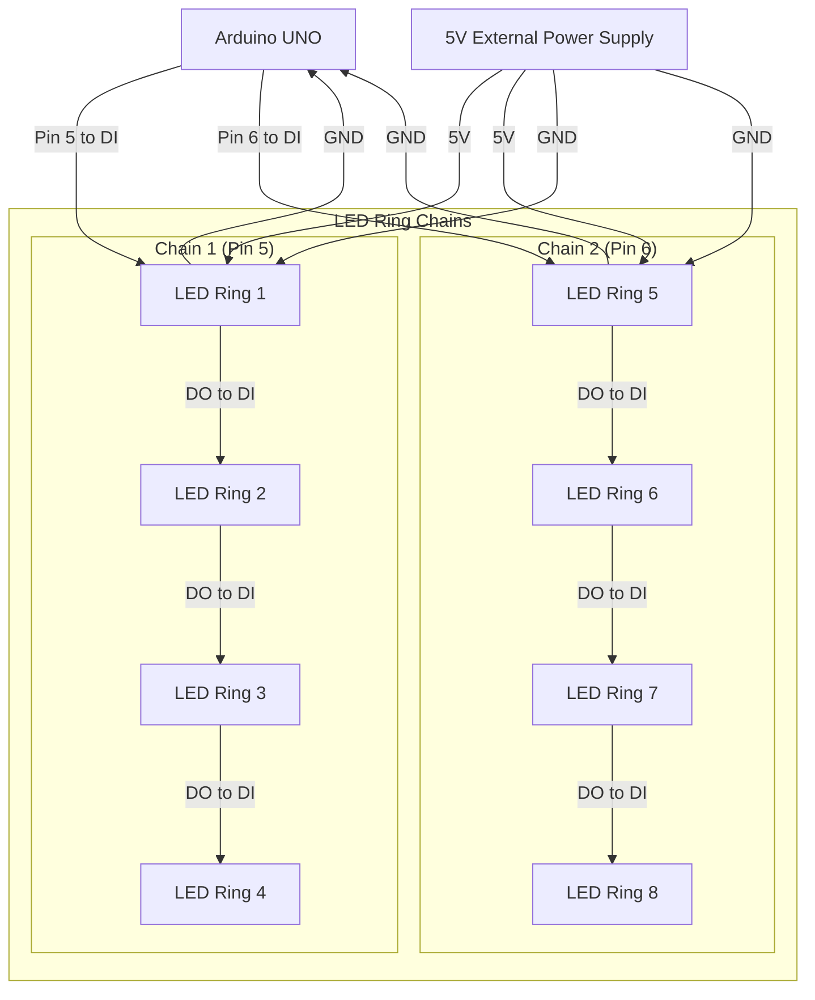

# Wiring diagram

```mermaid

graph TD
    %% Arduino and main components
    ARDUINO[Arduino UNO]
    
    %% LED Rings
    RING1[LED Ring 1]
    RING2[LED Ring 2]
    RING3[LED Ring 3]
    RING4[LED Ring 4]
    RING5[LED Ring 5]
    RING6[LED Ring 6]
    RING7[LED Ring 7]
    RING8[LED Ring 8]
    
    
    %% Power Supply
    PWR[5V External Power Supply]
    
    %% Arduino connection to LED Ring chains
    ARDUINO ---> |Pin 5 to DI| RING1
    ARDUINO ---> |Pin 6 to DI| RING5
    
    %% LED Ring chain 1 (daisy chaining)
    RING1 ---> |DO to DI| RING2
    RING2 ---> |DO to DI| RING3
    RING3 ---> |DO to DI| RING4
    
    %% LED Ring chain 2 (daisy chaining)
    RING5 ---> |DO to DI| RING6
    RING6 ---> |DO to DI| RING7
    RING7 ---> |DO to DI| RING8
    
    %% Power connections
    PWR ---> |5V| RING1
    PWR ---> |5V| RING5
    PWR ---> |GND| RING1
    PWR ---> |GND| RING5
    
    %% Shared ground
    RING1 ---> |GND| ARDUINO
    RING5 ---> |GND| ARDUINO
    %% Component descriptions
    subgraph "LED Ring Chains"
        subgraph "Chain 1 (Pin 5)"
            RING1
            RING2
            RING3
            RING4
        end
        subgraph "Chain 2 (Pin 6)"
            RING5
            RING6
            RING7
            RING8
        end
    end
    

```
